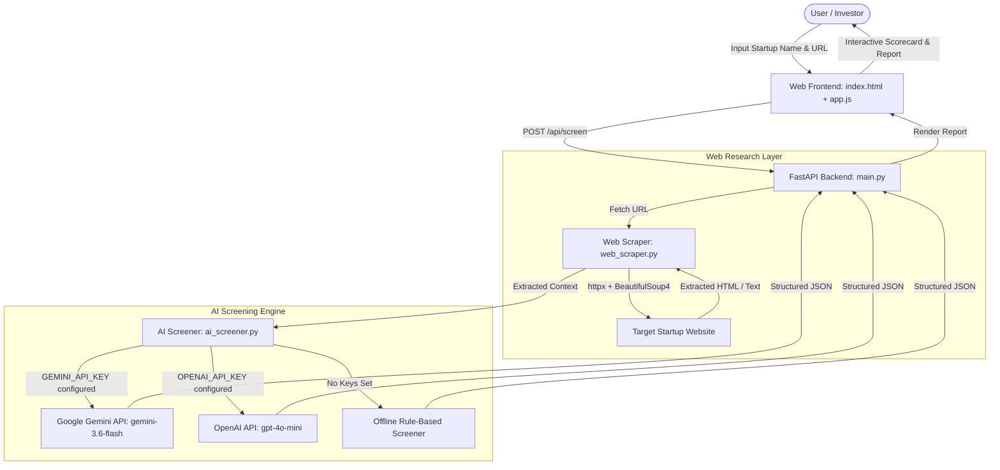

# VC Thesis Screener — Documentation & User Guide

> **Prototype AI-Powered Venture Capital Startup Screening Assistant**  
> *Specializing in Industrial Robotics & Physical AI across Germany, Netherlands, and Western Europe.*

---

## Table of Contents
1. [Overview & Objective](#overview--objective)
2. [Investment Thesis Specification](#investment-thesis-specification)
3. [System Architecture](#system-architecture)
4. [Tutorial 1: Getting Started Locally](#tutorial-1-getting-started-locally)
5. [Tutorial 2: Free Gemini API Key Setup](#tutorial-2-free-gemini-api-key-setup)
6. [Tutorial 3: How to Use the Web Application](#tutorial-3-how-to-use-the-web-application)
7. [Tutorial 4: Deploying to Vercel](#tutorial-4-deploying-to-vercel)
8. [API Reference & Data Contracts](#api-reference--data-contracts)
9. [Troubleshooting & FAQs](#troubleshooting--faqs)

---

## Overview & Objective

The **VC Thesis Screener** is a lightweight, high-speed venture capital screening assistant. It conducts structured first-pass investment evaluations for pre-seed and seed startups against a specialized thesis in **Industrial Robotics** and **Physical AI**.

### Core Capabilities
- **Live Web Research**: Automatically fetches startup landing pages, extracting page titles, meta tags, and body text.
- **Strict Skepticism Filter**: Differentiates between *Verified Facts*, *Company Claims*, *Inferences*, and *Unknown Information*. Never invents funding, traction, or technical specs.
- **Structured 7-Criteria Scorecard**: Evaluates 1–5 ratings across *Thesis Fit*, *Geography Fit*, *Stage Fit*, *Founder/Technical Fit*, *Market Attractiveness*, *Defensibility*, and *Commercial Traction*.
- **Actionable Investment Report**: Outputs an Executive Summary, Positives, Risks/Red Flags, Key Unknowns, 5 Founder Questions, and a clear Recommendation (`PASS`, `WATCH`, `INVESTIGATE`, or `HIGH PRIORITY`).
- **Provider-Agnostic Engine**: Supports **Google Gemini** (`gemini-3.6-flash` free tier), **OpenAI**, or an **Offline Demo Mode** requiring zero API keys.

---

## Investment Thesis Specification

> *"I am building my edge by becoming a specialist in industrial robotics and Physical AI across Germany and Western Europe, focusing on pre-seed and seed startups building the enabling technologies for industrial automation."*

### 🎯 Focus Areas
- Industrial Robotics & Autonomous Systems
- Physical AI & Perception (Vision, Sensing, Sensor Fusion)
- Robot Manipulation & Actuation
- Simulation & Sim-to-Real Transfer Pipelines
- Industrial Automation Software & ROS-native Stacks
- Enabling Hardware/Software for Factory & Logistics Automation
- Humanoid Robotics *(where a credible industrial application exists)*

### 🌍 Geography & Stage
- **Target Geography**: Germany, Netherlands, Broader Western Europe.
- **Target Stage**: Pre-seed and Seed.
- **Founder Profile**: Technical founders, deep engineering capability, founder-market fit, proven understanding of manufacturing/logistics problems.

---

## System Architecture



---

## Tutorial 1: Getting Started Locally

### Prerequisites
- Python 3.10 or higher
- Git

### Step 1: Clone Repository
```bash
git clone https://github.com/work-ishaanpandit/VC-Thesis-Scanner.git
cd VC-Thesis-Scanner
```

### Step 2: Install Dependencies
```bash
python -m pip install -r requirements.txt
```

### Step 3: Run Application Server
```bash
python -m uvicorn app.main:app --host 127.0.0.1 --port 8000
```

### Step 4: Open in Browser
Navigate to **[http://127.0.0.1:8000](http://127.0.0.1:8000)**.

---

## Tutorial 2: Free Gemini API Key Setup

The app works in **Offline Demo Mode** out of the box. To enable live Gemini AI analysis for free:

1. Go to [Google AI Studio](https://aistudio.google.com/app/apikey).
2. Sign in with any Google / Gmail account *(no credit card required)*.
3. Click **Create API Key** → Copy your key string (starts with `AIza...`).
4. Paste your key into `.env`:
   ```env
   GEMINI_API_KEY=AIzaSyYourGeneratedGeminiKeyHere
   GEMINI_MODEL=gemini-3.6-flash
   ```
5. Alternatively, open the web app, click **⚙️ Settings**, and paste your API key directly into the UI!

---

## Tutorial 3: How to Use the Web Application

1. **Quick Test Presets**: Click **⚡ RobCo (Munich)** or **⚡ Waku Robotics (Dresden)** to pre-fill realistic startup data instantly.
2. **Custom Screening**:
   - **Startup Name**: Enter the company name (e.g. *RobCo*).
   - **Website URL**: Enter company URL (e.g. `https://robco.de`).
   - **Additional Notes**: Paste pitch deck notes, team backgrounds, or product descriptions.
3. **Run Screen**: Click **Run Investment Screen**.
4. **Review Report**:
   - **Recommendation Badge**: View high-level verdict (`HIGH PRIORITY`, `INVESTIGATE`, `WATCH`, `PASS`).
   - **Investment Scorecard**: Review 1–5 scores across all 7 thesis criteria.
   - **Positives vs Red Flags**: Compare strengths and potential risks.
   - **Founder Questions**: Review 5 high-value questions to ask in founder calls.

---

## Tutorial 4: Deploying to Vercel

### Method 1: Deploy via GitHub (Recommended)

1. Push your repository to GitHub:
   ```bash
   git add .
   git commit -m "Deploy VC Thesis Screener"
   git push origin main
   ```
2. Open [Vercel Dashboard](https://vercel.com/new).
3. Import your `VC-Thesis-Scanner` repository.
4. Add Environment Variable:
   - **Key**: `GEMINI_API_KEY`
   - **Value**: `your_gemini_api_key`
5. Click **Deploy**. Vercel will build the serverless Python backend and launch your app!

---

## API Reference & Data Contracts

### 1. Health Check
`GET /api/health`

**Response:**
```json
{
  "status": "online",
  "gemini_key_configured": true,
  "openai_key_configured": false,
  "active_provider": "Gemini",
  "gemini_model": "gemini-3.6-flash",
  "openai_model": "gpt-4o-mini"
}
```

### 2. Screen Startup
`POST /api/screen`

**Request Body:**
```json
{
  "startup_name": "RobCo",
  "startup_website": "https://robco.de",
  "additional_notes": "Munich industrial robotics startup building modular robot arms."
}
```

---

## Troubleshooting & FAQs

> [!TIP]
> **Q: What happens if I don't provide an API key?**  
> **A:** The app automatically runs in **Offline Demo Mode**, using an analytical rule engine to score startups without making external API calls.

> [!NOTE]
> **Q: What Gemini model is used?**  
> **A:** It defaults to `gemini-3.6-flash`, which is Google's fast, free-tier model.

> [!IMPORTANT]
> **Q: How does web fetching work?**  
> **A:** The backend uses `httpx` and `BeautifulSoup4` to parse page titles, meta descriptions, headings, and body text, passing clean raw context into the AI prompt.
